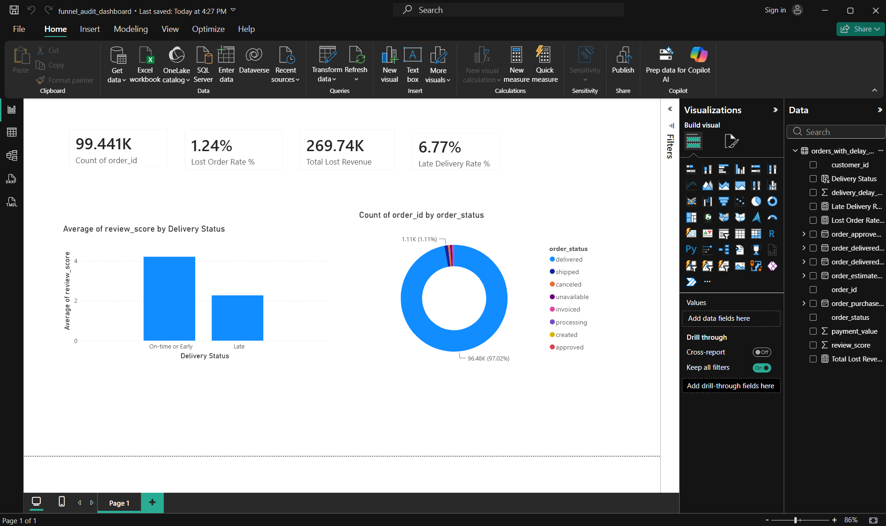

# E-Commerce Revenue Leakage & Funnel Audit

## Business Problem
This e-commerce marketplace loses **1.24% of all orders** to cancellation or 
unavailability — a small-sounding rate that represents **$269,735.11 in lost 
revenue**. Worse, these lost orders are worth **36% more than a typical order**, 
meaning the business is disproportionately losing its highest-value transactions. 
Separately, **6.77% of deliveries arrive late**, and late deliveries correlate 
with a near-total collapse in customer satisfaction — a likely feeder into 
future cancellations.

## Key Findings

- **Lost orders are high-value, not low-value.** Canceled/unavailable orders 
  average **$218.63**, compared to **$160.99** for a typical order — a 36% premium.
- **Late delivery devastates customer satisfaction.** Orders delivered late 
  average a **2.27-star review** (out of 5), compared to **4.29 stars** for 
  on-time or early deliveries — a nearly 2-point gap.
- **The delivery estimate has significant built-in buffer.** On average, orders 
  arrive **11.9 days earlier** than the estimated delivery date — suggesting 
  Olist's estimates are deliberately conservative, which may itself create 
  missed-expectation risk when that buffer runs out.
- **The core issue is concentrated, not widespread.** 97% of orders are 
  successfully delivered — the leakage is a smaller, addressable problem rather 
  than a systemic failure.

## Dashboard

## Tools & Methods

| Tool | Purpose |
|---|---|
| **Python (pandas)** | Multi-table data cleaning, datetime conversion, delay calculation, table merging |
| **SQL (SQLite)** | Joined business-question queries across Orders, Payments, Reviews |
| **Power BI (DAX)** | Interactive dashboard with live-recalculating measures |

## Data Cleaning Notes

- Fixed a `UnicodeDecodeError` across all Olist CSVs by reading with 
  `encoding='latin1'` (Portuguese-language source data).
- Converted 5 date columns from text to proper datetime type to enable 
  delivery delay calculations.
- Handled duplicate rows introduced by multi-installment payments and 
  multi-entry reviews by aggregating (`sum` for payments, `mean` for reviews) 
  before merging on `order_id`, preventing row duplication.
- 8 order records show `order_status = 'delivered'` with no recorded delivery 
  date — a data logging inconsistency, statistically negligible (0.008% of 
  delivered orders), noted but not further investigated.

## Project Structure
data/           Raw and merged datasets
notebooks/      Python analysis scripts
sql/            SQLite database and finalized queries
powerbi/        Power BI dashboard file (.pbix)
images/         Dashboard screenshots

## Dataset
[Brazilian E-Commerce Public Dataset by Olist](https://www.kaggle.com/datasets/olistbr/brazilian-ecommerce) 
(Kaggle) — 99,441 orders across 9 relational tables.